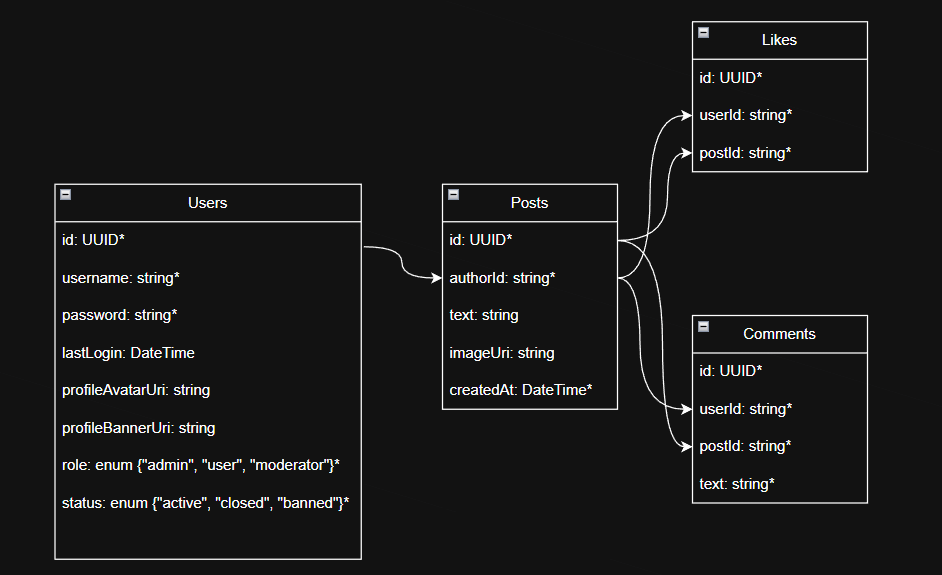

<div align="center" >
<p style="font-size: 36px; color: #ffffffcc; font-weight: bold">
The Wall
</p>
<p>
  <a href="https://isocpp.org/">
    
  </a>
  <a href="https://www.postgresql.org/">
    
  </a>
  <a href="https://crowcpp.org/">
    
  </a>
  <a href="LICENSE">
    
  </a>
</p>

</div>

---

## Overview

#### //todo: make an overview;

## Getting Started

### Prerequisites
- CMake 3.20+
- PostgreSQL 13+
- vcpkg

### Installation

```bash
git clone https://github.com/Aragam113/TheWall-Backend.git
cd TheWall-Backend
cmake -B build
cmake --build build
```

### Environment

```env
PORT = 18080
HOST = localhost
USER = YOUR_USER
PASSWORD = YOUR_PASSWORD
DB_NAME = the_wall_db
DB_PORT = 5432
```

---

## Database Schema

<div align="center">
    
</div>

---

## API Endpoints

| Method | Endpoint        | Auth | Description                   |
|--------|-----------------|------|-------------------------------|
| GET    | '/'             | No   | Hello world                   |
| GET    | '/health'       | No   | Server health check           |
| POST   | '/login'        | No   | Test user login               |
| GET    | '/private/data' | Yes  | Get logined user private data |


## Project Structure

```text
├───.githooks
├───.github
├───git-assets
│   └───db_schema.png
├───include
│   └───laserpants
│       └───dotenv
│           └───dotenv.h
└───src
    ├───main.cpp
    │   
    ├───application
    │   ├───Application.cpp
    │   └───Application.h
    │       
    ├───config
    │   ├───config.cpp
    │   └───config.h
    │       
    ├───database
    │   ├───database.cpp
    │   └───database.h
    │       
    └───middlewares
        └───BearerAuthMiddleware.h


```